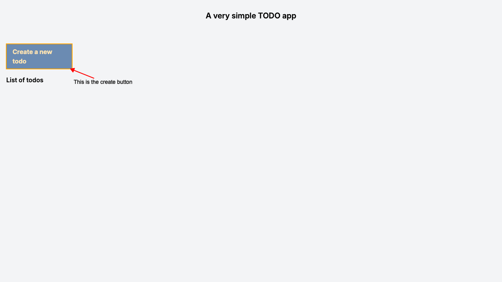
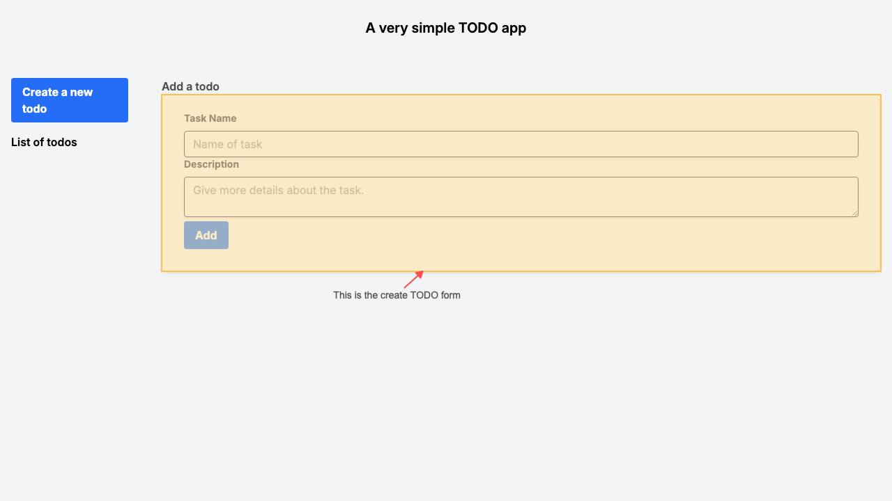
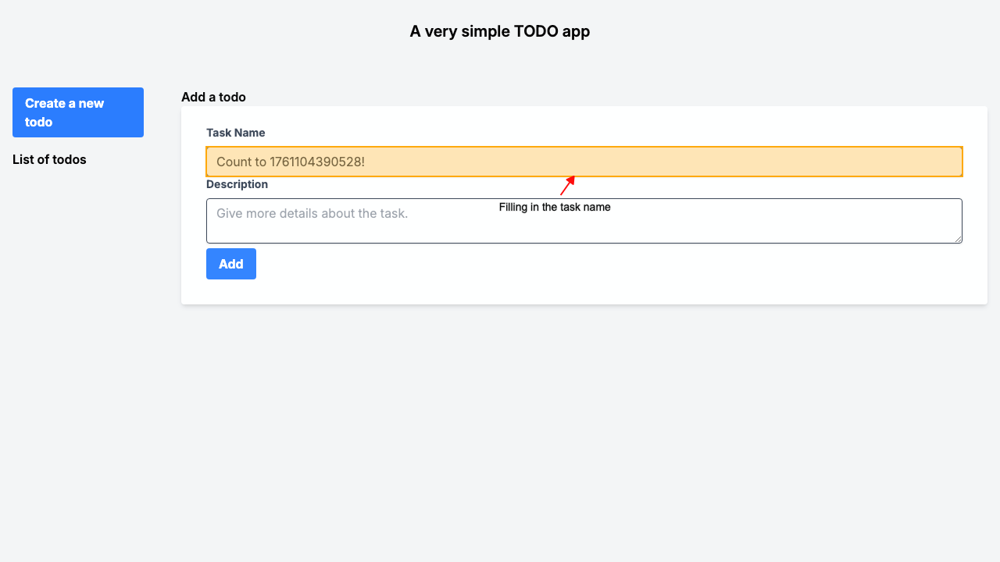
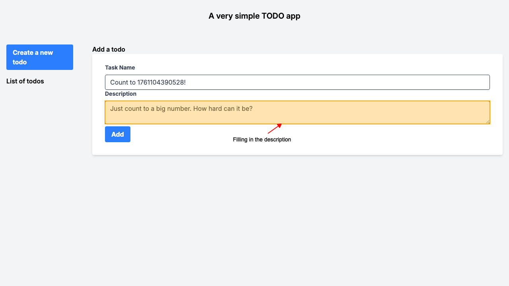
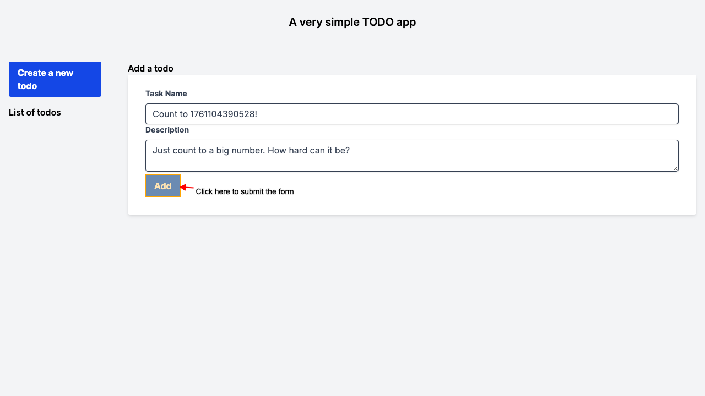
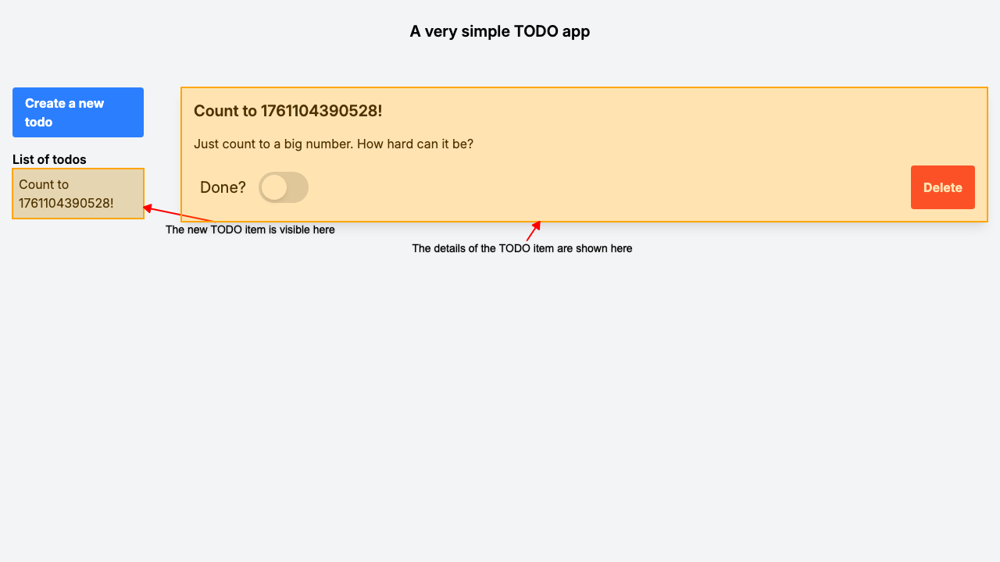

# REMIX TODO App

## The app title

When you navigate to `/todo`.
The page should display the title of the app.

## Add a new TODO item

Clicking the create button will open the create form.

The create form should be visible.

Enter a name for the todo item.

Enter a description for the todo item.

Submit the form.

The new TODO item should be visible on the page and it should take you to the todo details.

